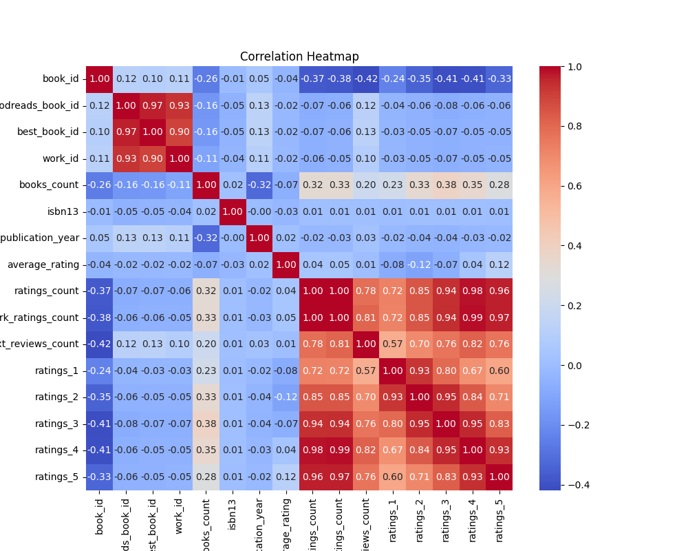
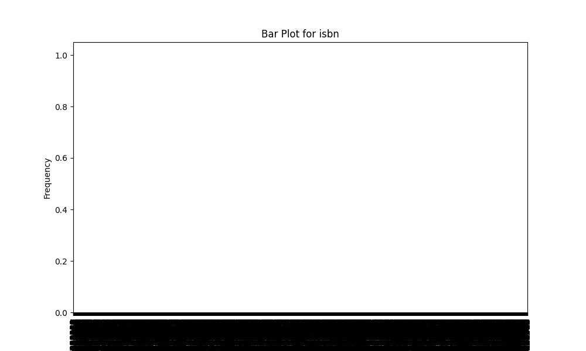
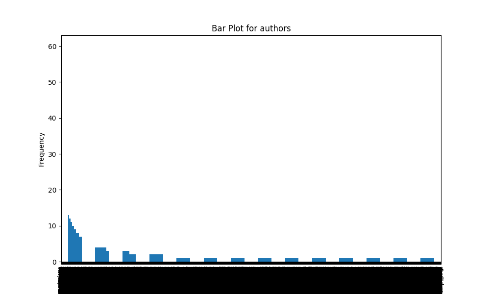
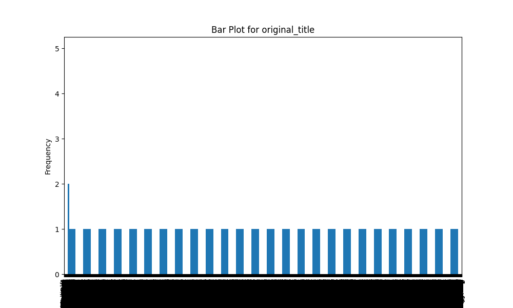
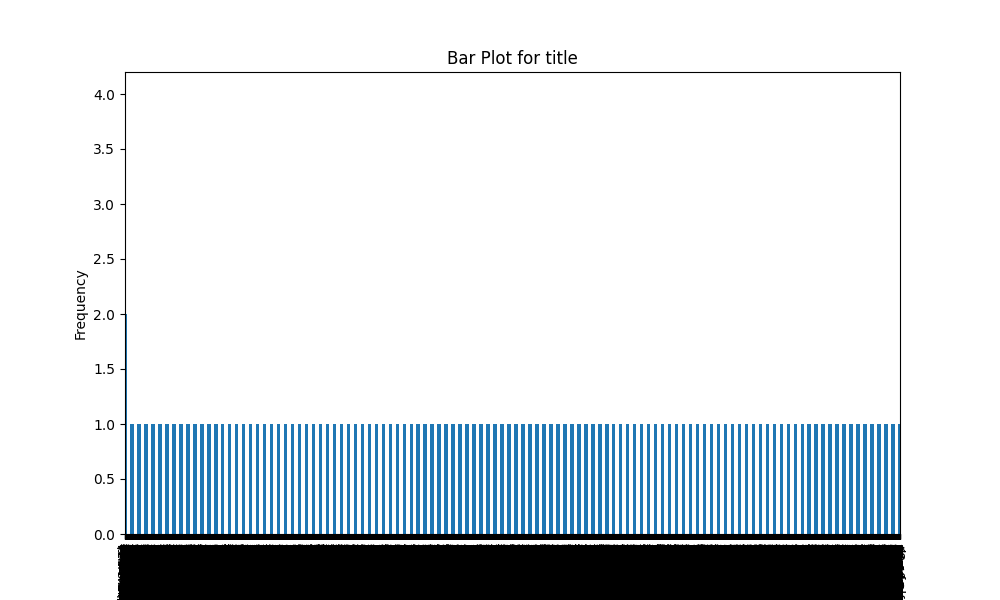
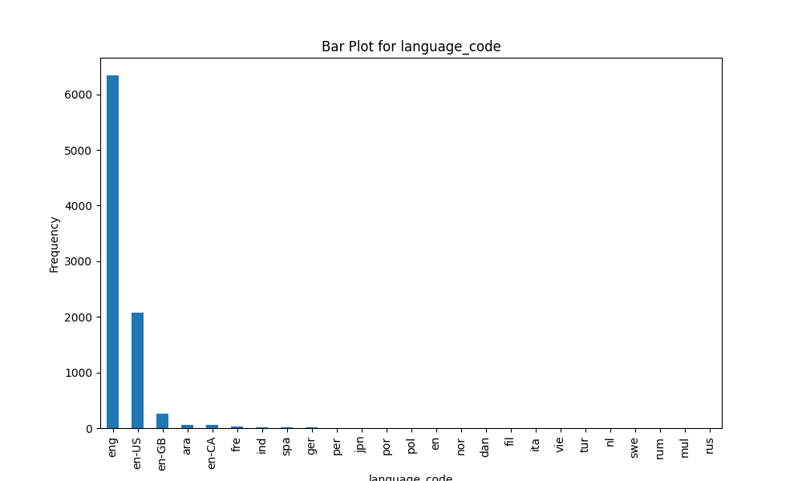

# Automated Data Analysis Report

## Dataset Summary
- Shape: (10000, 23)
- Columns: book_id, goodreads_book_id, best_book_id, work_id, books_count, isbn, isbn13, authors, original_publication_year, original_title, title, language_code, average_rating, ratings_count, work_ratings_count, work_text_reviews_count, ratings_1, ratings_2, ratings_3, ratings_4, ratings_5, image_url, small_image_url
- Missing Values: {'book_id': 0, 'goodreads_book_id': 0, 'best_book_id': 0, 'work_id': 0, 'books_count': 0, 'isbn': 700, 'isbn13': 585, 'authors': 0, 'original_publication_year': 21, 'original_title': 585, 'title': 0, 'language_code': 1084, 'average_rating': 0, 'ratings_count': 0, 'work_ratings_count': 0, 'work_text_reviews_count': 0, 'ratings_1': 0, 'ratings_2': 0, 'ratings_3': 0, 'ratings_4': 0, 'ratings_5': 0, 'image_url': 0, 'small_image_url': 0}

## Insights from Analysis
Based on the provided dataset summary, here are some key insights:

### Dataset Overview
- **Shape**: The dataset contains 10,000 records (books) and 23 columns (attributes).
- **Data Types**: The columns include a mix of integer (`int64`), floating-point (`float64`), and object (string) types, suggesting diverse data types for different attributes.

### Columns and Attributes
- Key attributes of interest include:
  - **Identifiers**: `book_id`, `goodreads_book_id`, `best_book_id`, and `work_id` serve as unique identifiers for records.
  - **Title and Author**: Columns like `original_title`, `title`, and `authors` provide information about the literary work and its authors.
  - **Ratings**: `average_rating`, `ratings_count`, and detailed rating distributions (`ratings_1` through `ratings_5`) give insight into how well each book is received by readers.
  - **Publishing Information**: `original_publication_year` indicates when the book was first published, while `language_code` tells the language in which the book is written.

### Missing Values
- Several columns have missing values, which may affect analysis:
  - **ISBN**: Missing values in `isbn` (700 missing) and `isbn13` (585 missing) could impact bibliographic searches and lookups.
  - **Original Publication Year**: 21 missing entries may affect temporal analysis regarding trends in book publications.
  - **Original Title**: 585 missing entries could lead to lost context about the literature.
  - **Language Code**: 1,084 missing values could hinder analysis by language.

### Ratings and Popularity
- **Average Ratings**: The average ratings for several popular books range from about 3.57 to 4.44, suggesting a generally high evaluation among readers.
- **Ratings Counts**: The `ratings_count` can be quite high, indicating popularity, with numbers exceeding millions for bestsellers like "The Hunger Games" and "Harry Potter." This could be a sign of robust engagement from readers.
- **Rating Distribution**: The detailed rating breakdown helps understand reader opinions:
  - For "The Hunger Games," a substantial number of 5-star ratings (2,706,317) suggests it’s received very favorably.
  - On the other hand, "Twilight" received a mixed distribution of ratings, indicating diverse reader opinions.

### Authors and Their Works
- There are multiple noted authors such as Suzanne Collins, J.K. Rowling, Stephenie Meyer, Harper Lee, and F. Scott Fitzgerald, whose works are included in the dataset. 
- This dataset could provide fascinating trends on author popularity and generational shifts in reading preferences.

### Language Distribution
- The presence of a `language_code` column allows for the analysis of books across different languages, though a substantial number of missing values could cause a skewed view.

### Potential Analyses
- **Trend Analyses**: Examine trends in publication years against average ratings to assess if newer works are preferable to older classics.
- **Sentiment Analysis**: Using `work_text_reviews_count`, sentiment analysis could be conducted on reader reviews to gauge how opinions correlate with average ratings.
- **Comparative Analysis**: Compare popularity and ratings between books by the same author or within similar genres or categories.

### Conclusion
This dataset is ripe for comprehensive analysis, particularly in areas such as reader preferences, trends in book publishing, and author popularity. However, attention should be given to addressing the missing values to enhance the validity and robustness of analyses.

## Visualizations

