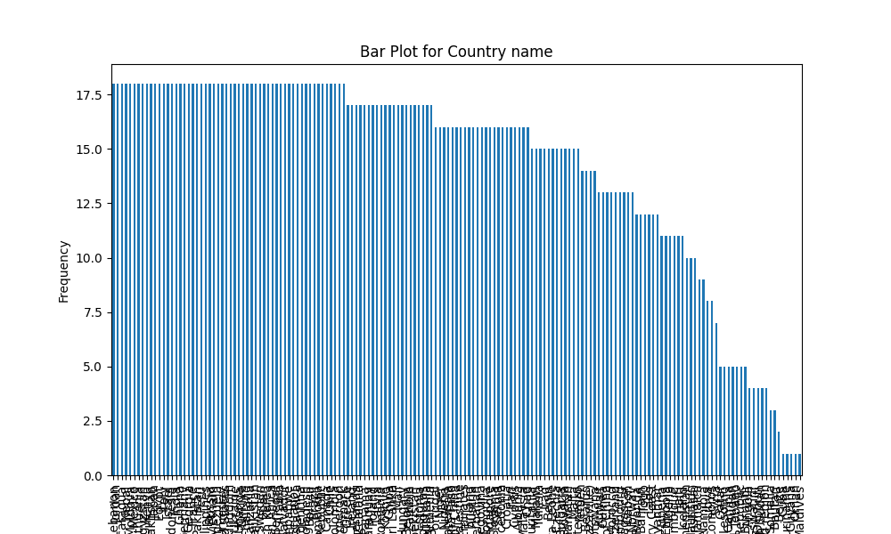

# Automated Data Analysis Report

## Dataset Summary
- Shape: (2363, 11)
- Columns: Country name, year, Life Ladder, Log GDP per capita, Social support, Healthy life expectancy at birth, Freedom to make life choices, Generosity, Perceptions of corruption, Positive affect, Negative affect
- Missing Values: {'Country name': 0, 'year': 0, 'Life Ladder': 0, 'Log GDP per capita': 28, 'Social support': 13, 'Healthy life expectancy at birth': 63, 'Freedom to make life choices': 36, 'Generosity': 81, 'Perceptions of corruption': 125, 'Positive affect': 24, 'Negative affect': 16}

## Insights from Analysis
Based on the provided dataset summary, here are some key insights:

### Dataset Overview:
- **Dimensions**: The dataset contains 2,363 rows and 11 columns, indicating a robust sample size likely encompassing multiple countries across different years.
- **Columns**: The features in the dataset include:
  - **Country name**: (Categorical) The name of the country.
  - **Year**: (Numeric) The corresponding year of the observation.
  - **Life Ladder**: (Continuous) A subjective measure of well-being.
  - **Log GDP per capita**: (Continuous) The logarithmic transformation of GDP per capita indicative of economic wealth.
  - **Social support**: (Continuous) A measure of perceived support from family and friends.
  - **Healthy life expectancy at birth**: (Continuous) Average number of years a newborn is expected to live in good health.
  - **Freedom to make life choices**: (Continuous) A measure of personal freedom.
  - **Generosity**: (Continuous) Self-reported generosity levels.
  - **Perceptions of corruption**: (Continuous) Self-reported views on corruption in government and business.
  - **Positive affect**: (Continuous) The presence of positive emotions.
  - **Negative affect**: (Continuous) The presence of negative emotions.

### Missing Values:
- The dataset contains various missing values:
  - **Log GDP per capita**: 28 missing values.
  - **Social support**: 13 missing values.
  - **Healthy life expectancy at birth**: 63 missing values.
  - **Freedom to make life choices**: 36 missing values.
  - **Generosity**: 81 missing values.
  - **Perceptions of corruption**: 125 missing values.
  - **Positive affect**: 24 missing values.
  - **Negative affect**: 16 missing values.
  
  This could affect analyses, particularly if there are substantial gaps in key metrics like GDP and social support. Strategies for handling missing data (e.g., imputation or exclusion) should be considered based on their distributions.

### Sample Data Insights:
- The sample data shows fluctuations in well-being indicators for Afghanistan from 2008 to 2012. For instance:
  - The **Life Ladder** scores range from 3.724 in 2008 to a peak of 4.758 in 2010, suggesting short-term improvement, though it drops to 3.783 in 2012.
  - The **Log GDP per capita** shows a gradual increase, suggesting modest economic growth during this period.
  - **Social support** and **healthy life expectancy** values remain relatively stable, indicating that social factors and health metrics did not experience drastic changes.
  - **Freedom to make life choices** shows slight variation, reflecting changing sociopolitical conditions.
  - The **Perceptions of corruption** index shows a decline from 0.882 in 2008 to 0.707 in 2010, followed by a small recovery to 0.776 in 2012; this highlights ongoing concerns about governance.

### Key Relationships and Analysis Opportunities:
- **Correlation Analysis**: Various factors could be correlated, such as GDP per capita and Life Ladder. Exploring these relationships can illuminate how economic performance relates to reported well-being.
- **Trend Analysis**: Examining how these indicators evolve over years can provide insights into the long-term trends affecting each country.
- **Country Comparison**: Analyzing other countries (if available) within the dataset would help in assessing relative well-being against economic and social metrics, showcasing patterns and anomalies.
  
### Conclusion:
The dataset provides a comprehensive view of factors affecting life satisfaction across several years for various countries. Further analyses, particularly involving trend analyses and correlation studies, could yield valuable insights into the dynamics of happiness, economy, and governance on a global scale. Addressing the missing values is also crucial for robust statistical analyses.

## Visualizations

