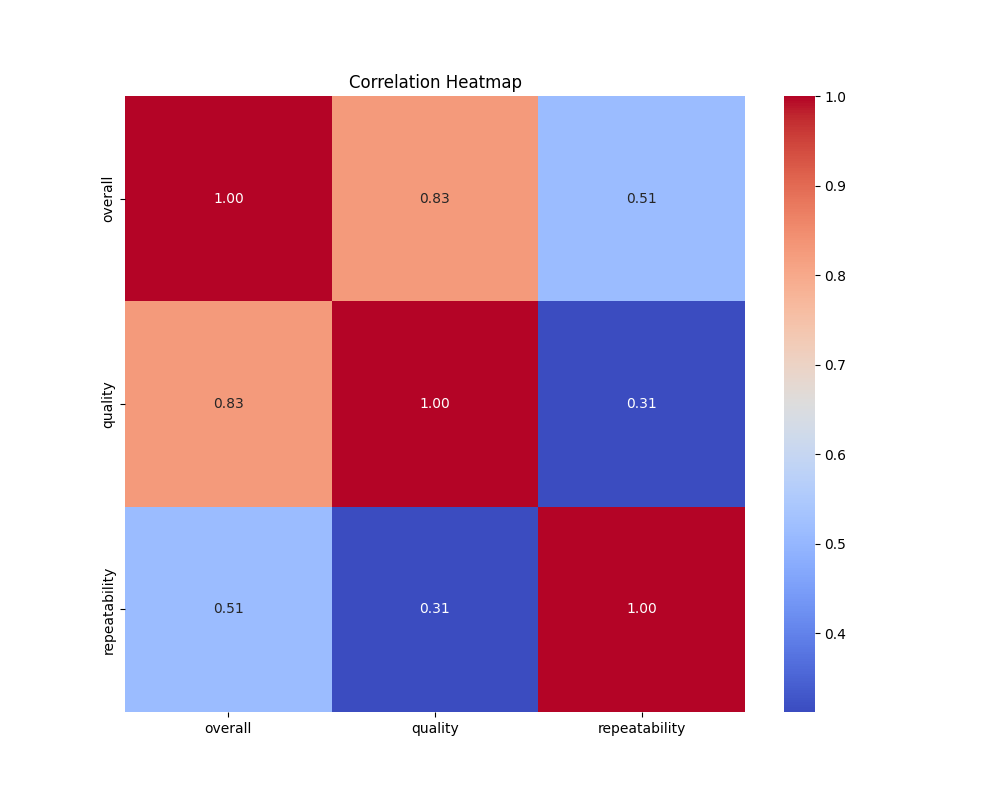
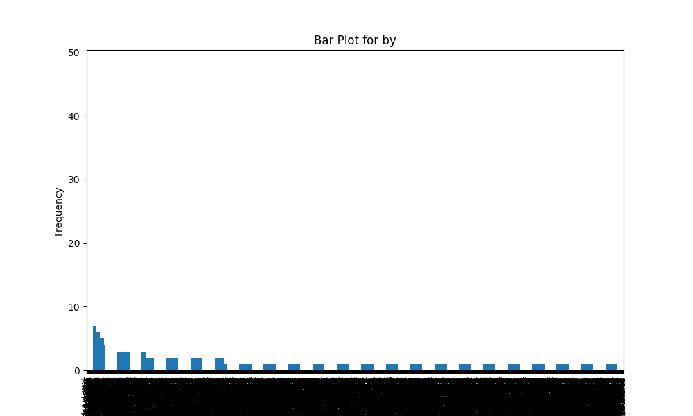

# Automated Data Analysis Report

## Dataset Summary
- Shape: (2652, 8)
- Columns: date, language, type, title, by, overall, quality, repeatability
- Missing Values: {'date': 99, 'language': 0, 'type': 0, 'title': 0, 'by': 262, 'overall': 0, 'quality': 0, 'repeatability': 0}

## Insights from Analysis
Based on the provided dataset summary, here are several key insights:

1. **Dataset Structure**:
   - The dataset contains **2,652 rows** and **8 columns**.
   - It has a variety of features related to movies, including `date`, `language`, `type`, `title`, `by`, as well as ratings (`overall`, `quality`, and `repeatability`).

2. **Column Types**:
   - The columns consist of both object types (strings) and integer types. Specifically:
     - `date`, `language`, `type`, `title`, `by`: Object type (likely categorical/textual data).
     - `overall`, `quality`, `repeatability`: Integer type (likely numerical ratings).

3. **Missing Values**:
   - There are **99 missing values** in the `date` column, which could be significant if this column is essential for time series analysis or trend identification. 
   - The `by` column has **262 missing values**, indicating that there are many entries where the creators or actors of the movies are not specified.
   - The other columns (`language`, `type`, `title`, `overall`, `quality`, `repeatability`) do not have any missing values.

4. **Language Distribution**:
   - The dataset appears to mainly focus on movies in certain languages, with a sample indicating the presence of at least **Tamil** and **Telugu** movies. An analysis of language distribution would provide insights into the linguistic diversity and representation within the dataset.

5. **Type of Content**:
   - The dataset categorizes entries as `type: movie`, indicating a specialized focus. If there are only movies, one could analyze trends or ratings specific to this format.

6. **Rating Analysis**:
   - The `overall`, `quality`, and `repeatability` ratings are integers. Analyzing the distribution of these ratings (min, max, average) can provide insights into the general sentiment towards the movies in the dataset.
   - Notably, the maximum values for `overall` and `quality` are both **5**, suggesting a standardized rating system that does not exceed this threshold.

7. **Sample Data**:
   - The sample data features different movies, primarily in Tamil, along with notable actors and directors. This shows a variety of stories or themes, but a deeper analysis would be warranted to determine commonalities or trends across movies.
   - The overall ratings in the sample range between 2 and 4, which suggests mixed reviews.

8. **Data Analysis Opportunities**:
   - **Temporal Analysis**: Since the dataset includes dates, one can analyze trends over time (e.g., yearly, monthly) regarding movie ratings or releases.
   - **Correlational Studies**: Investigate relationships between `quality`, `overall` ratings, and `repeatability` to understand how different aspects of movies are perceived.
   - **Actor/Director Impact**: Assess if there are correlations between specific actors/directors and the ratings to gauge their influence on movie reception.

### Recommendations for Further Analysis:
- Clean the dataset by addressing missing values, especially in the `date` and `by` columns.
- Visualize the distribution of ratings and categorize them by language or type for in-depth insights.
- Perform sentiment analysis, if text data is available for `title` or `by`, to gauge public perception towards different genres or figures in the film industry.
- Explore how the ratings vary by language to identify any trends or biases present in movie reviews.

## Visualizations

